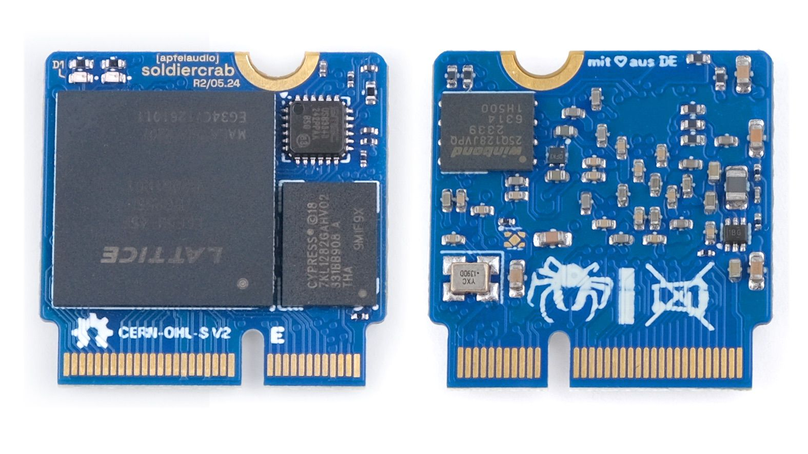

# SoldierCrab

<sup>WARN: :construction: under construction! :construction: - this hardware is under active development</sup>



[**SoldierCrab**](https://en.wikipedia.org/wiki/Mictyris_longicarpus) is an embeddable FPGA SoM (System-on-Module) designed for use in high-speed audio and USB applications.
It is the brain of [tiliqua](https://github.com/apfelaudio/tiliqua) and other [apfelaudio products](https://apfelaudio.com/).

**SoldierCrab** has the following core features:
- ECP5 FPGA (-25K or -45K variant in caBGA256 package)
- HyperRAM / oSPI-RAM (tested up to 400MByte/sec)
- USB2 PHY with exposed ID, it can be used in device or host mode
- 1V1 / 1V8 / 2V5 regulators onboard, 3V3 is all that's needed
- PROGRAMN internally exposed for multibooting bitstreams
- 2 indicator LEDs on the PCBA
- 48MHz master clock
- Card edge is basically: 47 exposed general purpose pins + 4-pin JTAG + USB2
- 22mmx22mm board size with M.2 E-key card edge (see 'Physical Compatibility' below)

## Hardware Revisions

**There are currently 2 revisions of SoldierCrab in the wild.**
- **R2.0**: LFE5U-45 with 7KL1282GAHY02 (3.3V HyperRAM, tested up to 200MB/sec)
- **R3.0**: LFE5U-25 with APS256XXN-OBR (1.8V oSPI-RAM, tested up to 400MB/sec)

PDF schematics for both can be found in the `schematics-pdf` folder.

## Footprint / Physical Compatibility

**The SoldierCrab is 22mmx22mm (+/- 0.3mm) with an M.2 E-key connector and offset mounting hole**. The mounting hole is offset such that this board is physically compatible with the SparkFun MicroMod format, however we **do not claim electrical compatibility with it** (even though this SoM will work with some MicroMod boards, the JTAG and I2C connections are in the wrong place for us to claim complete compatibility - this is intentional design choice to save routing space whilst trying to remain close to some kind of SoM standard).

On my carrier boards, as a connector I am using a [TE Connectivity 2199230-4](https://www.lcsc.com/product-detail/Edgeboard-Connectors_TE-Connectivity-2199230-4_C2977809.html).

A nice resource for [designing appropriate carrier boards can be found here](https://learn.sparkfun.com/tutorials/designing-with-micromod/how-to-design-a-micromod-carrier-board). However, keep the above in mind, make sure your JTAG and I2C pinouts match the SoldierCrab ones.

## Pinout

Aside from in the schematic, you can find a (tested!) version of the SoM pinout in `amaranth-boards` format [here in the Tiliqua repository](https://github.com/apfelaudio/tiliqua/blob/e4d43d70f0be8f8c47809bad94cfb414b5939a86/gateware/src/tiliqua/tiliqua_platform.py#L18-L129).

#### R3.0 Complementary Pairs

```
6 are adjacent on the same side:
[(13, 15), (20, 22), (52, 54), (58, 60), (62, 64), (68, 70)]
2 are almost adjacent (1 pin gap) on the same side:
[(55, 59), (67, 71)]
10 not adjacent (>1pin gap or different sides):
[(6, 17), (11, 19), (34, 35), (38, 41), (37, 43), (40, 47), (46, 57),, (63, 69)]
```

## Where do I get one?

If you are interested in prototyping with this SoM, feel free to send me an email. They are not generally available yet, but I plan to make it available on my store soon.

## Builds on the following (awesome) open-hardware projects
- The [Cynthion](https://github.com/greatscottgadgets/cynthion-hardware) project from Great Scott Gadgets.
- The [OrangeCrab](https://github.com/orangecrab-fpga/orangecrab-hardware) project from Greg Davill.
- [Sparkfun Micromod](https://www.sparkfun.com/micromod).

# License

**Copyright (C) 2024 S. Holzapfel, apfelaudio UG (haftungsbeschränkt)**

The files in this project are largely covered under the CERN Open-Hardware License V2 CERN-OHL-S, mirrored in the LICENSE text in this repository. This LICENSE and copyright notice do NOT apply to imported artifacts in this repository (i.e datasheets, third-party 3D models, symbols or footprints), or to dependencies released under a different (but compatible) open-source license.

# Derivative works

If you create or manufacture your own derivative hardware, the name "apfelaudio", the names of any apfelaudio products and the names of the authors, are *not to be used in derivative hardware or marketing materials*, except where obligated for attribution and for retaining the above copyright notice.

For example, your modified version of "apfelaudio SoldierCrab" could be called "Sandy Modular - Clawcruncher".
